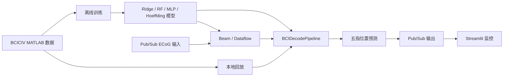

# 系统架构

项目围绕同一个有状态解码核心组织离线验证与云端流式推理。默认采样率为 1 kHz，
窗口长度为 300 ms，解码步长为 50 ms。

## 核心模块

- `src/config.py`：窗口、步长、采样率和模型目录等默认配置。
- `src/data_loader.py`：读取单被试 MATLAB 文件并按时间切分训练/验证段。
- `src/features.py`：从滑动窗口提取时域及生理频带特征。
- `src/models.py`、`src/models_nn.py`、`src/models_hoeffding.py`：模型封装。
- `src/pipeline.py`：离线回放与 Beam worker 共用的 `BCIDecodePipeline`。
- `src/beam/`：Beam 图构建、消息解析、有状态解码和 GCS 模型加载。
- `src/beam_dataflow.py`：DirectRunner 与 DataflowRunner 的命令行入口。
- `app.py`：从 Pub/Sub 拉取解码结果并显示五指曲线。

## 模型约定

- `model_simple.joblib`：Ridge 模型。
- `model_complex.joblib`：Random Forest 模型；`run_pipeline_sim` 默认读取它。
- `model_mlp.joblib`：MLP 模型；Dataflow 示例将它作为 complex 分支。
- `model_hoeffding.joblib`：River Hoeffding 回归树。

模型必须与推理时的通道数、窗口参数和特征开关一致。模型和训练产物不包含在公开
仓库中，需要使用相同配置本地生成或从受控存储加载。

## 云端数据流

`publish_ecog_stream.py` 将每个时间点编码为 JSON，主要字段包括
`session_id`、`channels` 和递增的 `sample_seq`。Beam 按 session 保存窗口状态，
达到解码步长后调用共享 pipeline，并将 prediction 写入输出 Topic；无法解析的消息
可写入 dead-letter 输出。
